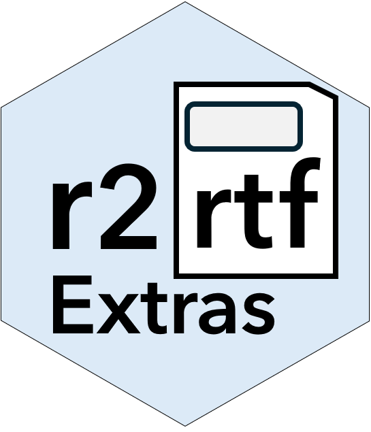

# r2rtfExtras <a href="https://medtronic-biostatistics.github.io/r2rtfExtras/"></a>

The goal of `r2rtfExtras` is to provide some additional helper functions
to assist in creating RTF output with [`r2rtf`](https://github.com/Merck/r2rtf/).

The primary wrapper functions are `df_to_rtf` and `fig_to_rtf` which are
opinionated wrappers around boilerplate `r2rtf` code. There are additional
capabilities currently not *yet* built into `r2rtf`. The [`r2rtf`
package](https://github.com/Merck/r2rtf/) remains an amazing tool for generating
output in the RTF format. Make sure to read the official documentation.

This package is currently under active development.

## Installation

The package can currently be installed from this Github repository using
the following:

```         
# If needed install.packages("remotes")
remotes::install_github("Medtronic-Biostatistics/r2rtfExtras")
```

See the [package website](https://medtronic-biostatistics.github.io/r2rtfExtras/) for
more details.